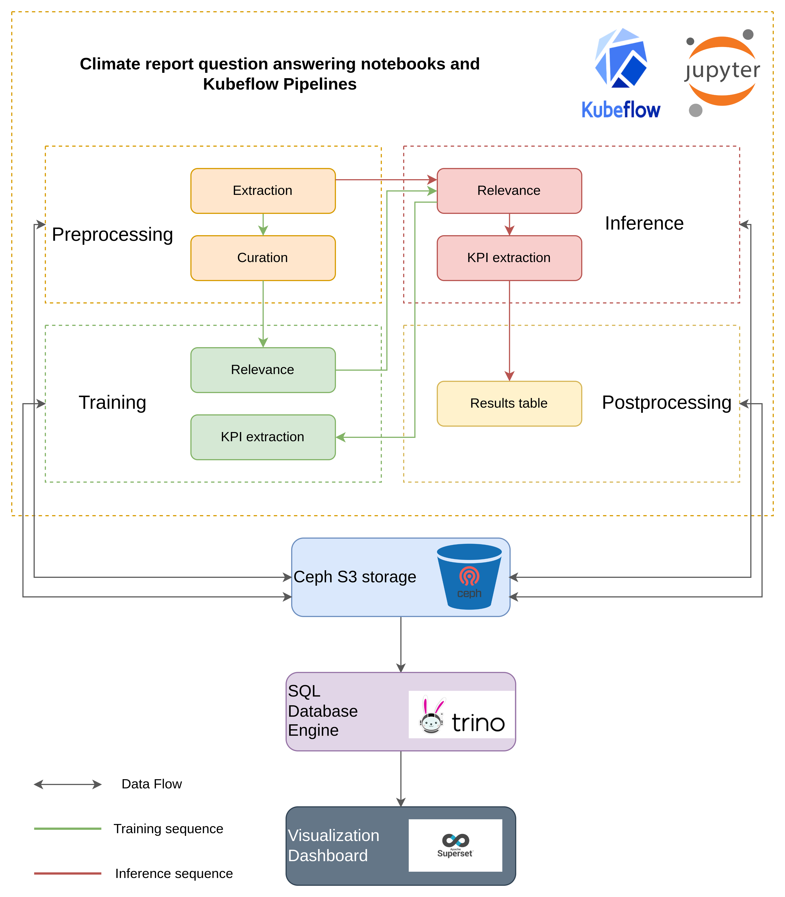

> [!IMPORTANT]
> On June 26 2024, Linux Foundation announced the merger of its financial services umbrella, the Fintech Open Source Foundation ([FINOS](https://finos.org)), with OS-Climate, an open source community dedicated to building data technologies, modeling, and analytic tools that will drive global capital flows into climate change mitigation and resilience; OS-Climate projects are in the process of transitioning to the [FINOS governance framework](https://community.finos.org/docs/governance); read more on [finos.org/press/finos-join-forces-os-open-source-climate-sustainability-esg](https://finos.org/press/finos-join-forces-os-open-source-climate-sustainability-esg)

# Using Open Data Hub toolkit and Operate First infrastructure for OS-Climate

This repository is the central location for the demos the Open Services (previously AICoE) team is developing within the [OS-Climate](https://github.com/os-climate) project.

This demo shows how to use the tools provided by [Open Data Hub](https://opendatahub.io/) (ODH) running on the [Operate First](https://www.operate-first.cloud) cluster to perform ETL, create training and inference pipelines, create interactive dashboards and visualizations of our data. Specifically, we will define pipelines that preprocess data, train Natural Language Processing (NLP) models, and run inference, and finally display the results on a dashboard. We adapt the data processing and inference pipelines developed by the ALLIANZ NLP team for the OS climate project in this [repository](https://github.com/os-climate/corporate_data_pipeline). The inference pipeline takes raw pdf files as input and extracts the text content from them. Then, it uses a pre-trained language model to determine which paragraphs are relevant to answering each KPI question. Next, it uses another pre-trained language model to extract precise answers for these questions from the corresponding relevant paragraphs. Lastly, it uploads these results to a table on Trino.

The key components of the ODH infrastructure used in this demo are [JupyterHub](https://jupyterhub-odh-jupyterhub.apps.odh-cl2.apps.os-climate.org/) with a container image, Elyra pipelines with the [Kubeflow](https://ml-pipeline-ui-kubeflow.apps.odh-cl2.apps.os-climate.org/) runtime, and [Apache Superset](https://superset-secure-odh-superset.apps.odh-cl1.apps.os-climate.org). The source data, processed data, trained model, and the output data are all stored on a bucket on the Ceph S3 storage. The following flowchart depicts the overview of different stages of the project.

# Contents

### [JupyterHub Image Setup (AICoE-CI, Thoth)](docs/jh-image-setup.md)
### [Access JupyterHub Environment](docs/access-jh.md)
### [Set Up Experiments](docs/setup-experiments.md)
### [Model Components](docs/ml-components.md)
### [Elyra pipeline](docs/elyra-pipeline.md)
### [How to contribute](docs/how-to-contribute.md)
