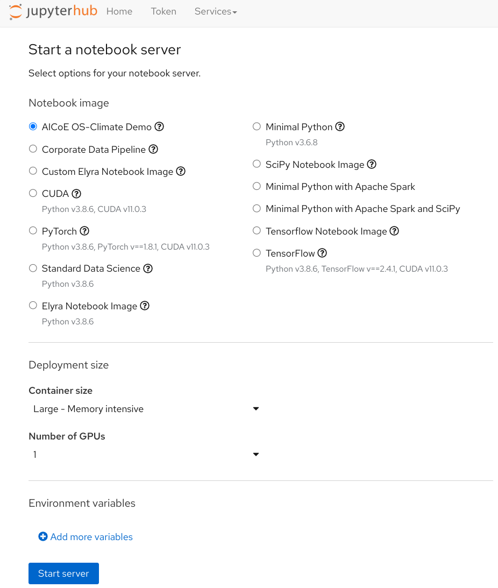
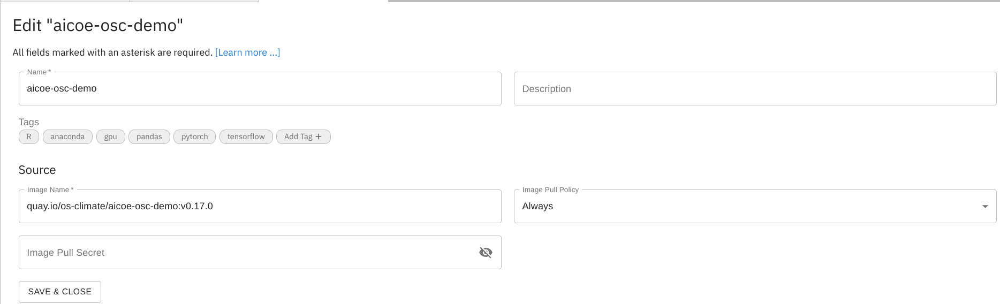
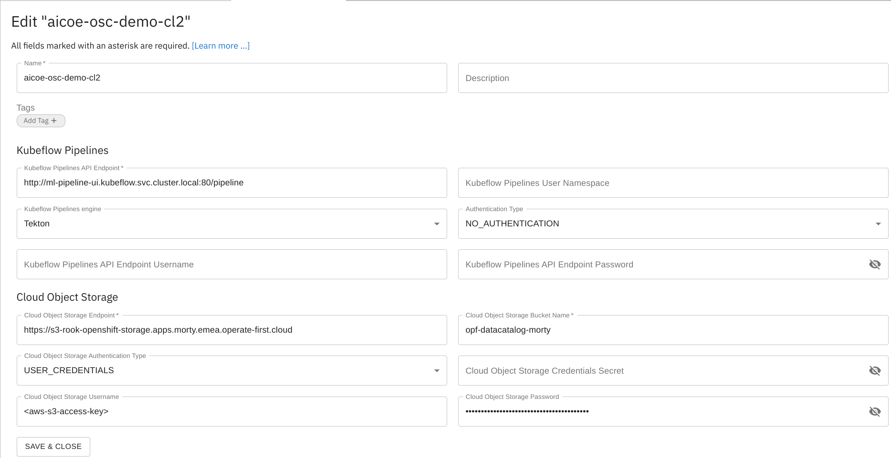
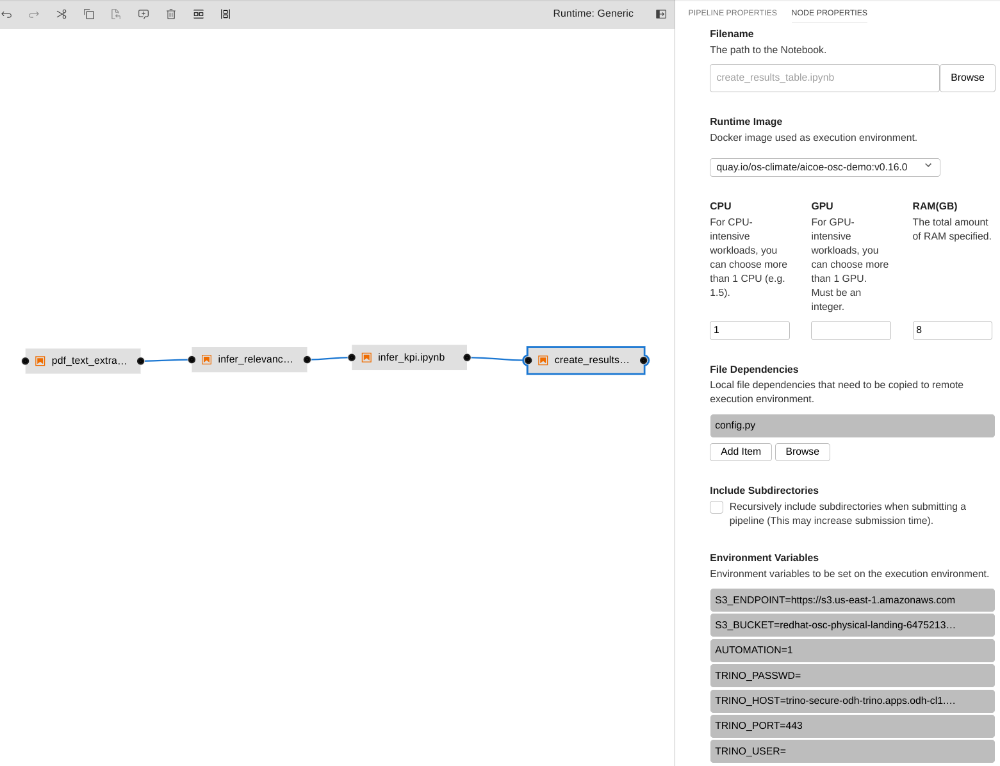
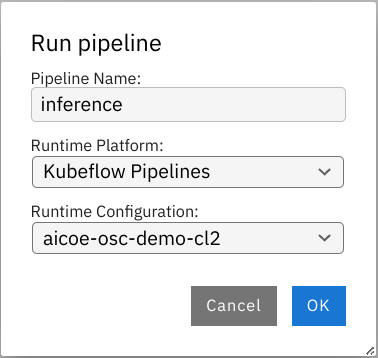

# Using Open Data Hub toolkit and Operate First infrastructure for OS-Climate

This repository is the central location for the demos the Open Services (previously AICoE) team is developing within the [OS-Climate](https://github.com/os-climate) project.

This demo shows how to use the tools provided by [Open Data Hub](https://opendatahub.io/) (ODH) running on the [Operate First](https://www.operate-first.cloud) cluster to perform ETL, create training and inference pipelines, create interactive dashboards and visualizations of our data. Specifically, we will define pipelines that preprocess data, train Natural Language Processing (NLP) models, and run inference, and finally display the results on a dashboard. We adapt the data processing and inference pipelines developed by the ALLIANZ NLP team for the OS climate project in this [repository](https://github.com/os-climate/corporate_data_pipeline). The inference pipeline takes raw pdf files as input and extracts the text content from them. Then, it uses a pre-trained language model to determine which paragraphs are relevant to answering each KPI question. Next, it uses another pre-trained language model to extract precise answers for these questions from the corresponding relevant paragraphs. Lastly, it uploads these results to a table on Trino.

The key components of the ODH infrastructure used in this demo are [JupyterHub](https://jupyterhub-odh-jupyterhub.apps.odh-cl2.apps.os-climate.org/) with a container image, Elyra pipelines with the [Kubeflow](https://ml-pipeline-ui-kubeflow.apps.odh-cl2.apps.os-climate.org/) runtime, and [Apache Superset](https://superset-secure-odh-superset.apps.odh-cl1.apps.os-climate.org). The source data, processed data, trained model, and the output data are all stored on a bucket on the Ceph S3 storage. The following flowchart depicts the overview of different stages of the project.

## JupyterHub Image Setup (AICoE-CI, Thoth)

To create a reproducible and shareable notebook development environment for the project, we will build a JupyterHub image with all the dependencies and source code baked into it. In this section, we will show how to do this using the ODH toolkit. You can also find a more general and detailed README, along with a walkthrough video tutorial, [here](https://aicoe-aiops.github.io/data-science-workflows/docs/develop_collaborate/create_and_deploy_jh_image.html).

To begin with, specify the python dependencies of the project via `Pipfile` / `Pipfile.lock`. Then, create a `Dockerfile` such as [this one](https://github.com/os-climate/aicoe-osc-demo/blob/master/Dockerfile) at the root of the project. In this, you can set the image [name](https://github.com/os-climate/aicoe-osc-demo/blob/master/Dockerfile#L1), git repo [name](https://github.com/os-climate/aicoe-osc-demo/blob/master/Dockerfile#L16) and [url](https://github.com/os-climate/aicoe-osc-demo/blob/master/Dockerfile#L17), and any system-level library [requirements](https://github.com/os-climate/aicoe-osc-demo/blob/master/Dockerfile#L22). Next, you need to set up [`aicoe-ci`](https://github.com/AICoE/aicoe-ci) on your github repo. To do so, follow the steps outlined [here](https://github.com/AICoE/aicoe-ci/tree/21e866d165071978bb857350196819ba74234e3e#setting-aicoe-ci-on-github-organizationrepository). In the `aicoe-ci.yaml` file, add `thoth-build` under the `check` section to enable image builds of your repo. You can configure how the image gets built and where it gets pushed by setting the build parameters described [here](https://github.com/AICoE/aicoe-ci/tree/21e866d165071978bb857350196819ba74234e3e#configuring-build-requirements). For example, we'll set `build-strategy: Dockerfile` and `dockerfile-path: Dockerfile` since we want to build our project image using the `Dockerfile` we created. Next, in order to enable AICoE-CI to push the image to the image repository, you can create a robot account and provide it with appropriate permissions as described [here](https://aicoe-aiops.github.io/data-science-workflows/docs/develop_collaborate/create_and_deploy_jh_image.html#setting-up-the-image-repository) (one-time setup). Finally, once AICoE-CI is set up, you can trigger a build of the image by creating a new tag release on your repo.

You can also use AICoE-CI to enable other Thoth services such as pre-commit checks, CI tests, etc. by adding `thoth-precommit`, `thoth-pytest`, and so on to the `check` section in `.aicoe-ci.yaml`.

## Access JupyterHub Environment

* In order to access the environment for the development of the project, you will have to be added to the odh-env-users group [here](https://github.com/orgs/os-climate/teams/odh-env-users). This can be done by opening an issue on [this page](https://github.com/os-climate/aicoe-osc-demo/issues) with the title "Add <USERNAME> to odh-env-users".

* Once added to the user’s list, you should be able to access [JupyterHub](https://jupyterhub-odh-jupyterhub.apps.odh-cl2.apps.os-climate.org), [Kubeflow Pipelines](http://ml-pipeline-ui-kubeflow.apps.odh-cl2.apps.os-climate.org/), [Trino](https://cloudbeaver-odh-trino.apps.odh-cl1.apps.os-climate.org/), and [Superset Dashboard](https://superset-secure-odh-superset.apps.odh-cl1.apps.os-climate.org/). Go ahead and log into the JupyterHub instance.

* After logging into JupyterHub, select the `AICoE OS-Climate Demo` image to get started with the project.

* Make sure you add the credentials file to the root folder of the project repository. For more details on how to set up your credentials, and retrieve your JWT token to access Trino, refer to the documentation given [here](https://github.com/os-climate/os_c_data_commons/blob/main/docs/setup-initial-environment.md#4-set-your-credentials-environment-variables).

* To install the dependencies needed for running the notebooks, you can run a `pipenv install` at the root of the repository or use the [Horus](https://github.com/thoth-station/jupyterlab-requirements/blob/dc92a4b14f539e6f464b3f202355242b4f729e13/docs/source/horus-magic-commands.md) magic commands from within the notebook.

## Set Up Experiments

Before you start running the data processing, training, or inference notebooks, you might want to create a dedicated space (a prefix on the s3 bucket) within which your dataset, models, and results will be stored. This way, our shared s3 bucket will be less cluttered and more organized. To do this, you can use the setup experiments [notebook](../demo2/setup_experiments.ipynb). Here, you can give a name to your experiment by setting the `EXPERIMENT_NAME` variable, and set how many pdfs you want to use in your experiment by setting the `SAMPLE_SIZE` variable, as shown in the notebook. Then you can run the rest of notebook to copy the appropriate pdfs, annotations, models, etc. to the prefix created as per the `EXPERIMENT_NAME` variable on the s3 bucket.

Additionally, you can configure where the raw pdfs, annotations, extracted pdfs, inference results, etc. get stored locally and on s3 bucket by updating the parameters defined in the [config.py](./notebooks/demo2/config.py) file. To update training or inference paramters, you can use the [config_farm_train.py](./notebooks/demo2/config_farm_train.py) and [config_qa_farm_train.py](./notebooks/demo2/config_qa_farm_train.py) files.

Note: if you don't have access to the s3 bucket, please open an issue [here](https://github.com/os-climate/OS-Climate-Community-Hub/issues/new?assignees=erikerlandson&labels=Bucket-credentials&template=request-credentials-for-an-os-climate-bucket.md&title=Request+credentials+for+an+os-climate+bucket).

## Data Preprocessing

Now let’s look at how we process raw data and prepare it for model training.
The source code for preprocessing is available in the `src` directory preinstalled in the JupyterHub image. This directory follows the project structure laid out in the [aicoe-aiops project template](https://github.com/aicoe-aiops/project-template).

* Extraction

    * In the text extraction notebook, we use pdf2image and pdfminer to extract text from the pdfs and then return json of the extracted text. We then upload the json file to the s3 bucket, and use it later for curation.

    * In the table extraction notebook, we use a pre-trained table detection neural network to extract the image coordinates of all the tables in the input pdfs. Then, we use image processing tools to convert the images of tables into csv files. Finally, we upload these csv files to the s3 bucket, and use it later for curation.

* Curation

    * In the text and table curation notebook, we will load the json files (one per pdf) and the corresponding csv files from the s3 bucket, and then add labels to it. For each text extract or table, we will assign label "1" to the correct corresponding text, and label "0" to a randomly selected text that does not correspond to the table.

## Training

* Train Relevance
    * In the train relevance notebook, we use the extracted and curated text from the data processing steps to train a relevance classifier model. That is, a model that takes a text paragraph as input, and determines whether it is relevant for answering a given KPI question. We also calculate some performance metrics for this trained model, namely the accuracy, precision, recall, and F1 scores on each of the KPIs. Finally, we save the model as well as the performance metrics on a s3 bucket for later use.

* Train KPI Extraction
    * Once we have a trained relevance classifier, we run it on the PDFs to get relevant paragraphs for each KPI. Then, in the train KPI extraction notebook, we re-format the relevance results into the SQuAD dataset format. Next, we proceed to train a question-answering (QA) model on this SQuAD formatted dataset. Then, we evaluate this QA model in terms of F1 scores on each of the KPIs. Finally, we save the trained model as well as the performance metrics on a s3 bucket.

## Inference

* Infer relevance
    * The infer relevance notebook takes in extracted text from the preprocessing stage and for a predefined set of KPI questions, finds relevant paragraphs from the text. These paragraphs are then used to find the exact answers to the questions. The notebook uses a fine-tuned language model stored on s3. The output prediction csv files are saved back on s3.

* Infer KPI
    * The infer kpi notebook takes in the results from the infer relevance stage and for the predefined set of KPI questions, it finds the exact answers from the relevant paragraphs. The notebook uses a fine-tuned language model stored on s3. The output prediction csv files are saved back on s3.

## Trino

* Results table
    * The create results table notebook takes the prediction output csv from infer KPI step and creates a Trino SQL table that can be used for querying and visualization in Superset.

## Elyra pipeline

To run the notebooks in a sequential and automated fashion, we use the Elyra notebook pipelines editor and kubeflow pipelines to ensure the workflow is automated.

You can access the saved Elyra Pipeline for Data Preprocessing (extraction + curation) [here](./notebooks/demo2/preprocessing.pipeline), and the one for end-to-end Inference (extraction + infer relevance + infer kpi + create tables) [here](./notebooks/demo2/inference.pipeline)

In order to set up an Elyra pipeline and run it on kubeflow pipelines, you can follow the instructions below:

### Setup Kubeflow Pipelines

* To run the pipeline, you will need the Elyra notebook pipeline editor. Make sure you are either on the `Custom Elyra Notebook Image` or the `AICoE OS-Climate Demo` image on the OS-Climate [JupyterHub](https://jupyterhub-odh-jupyterhub.apps.odh-cl2.apps.os-climate.org/)

* To get a Kubeflow pipeline running, you need to create a runtime image and a kubeflow pipelines runtime configuration.

#### Add runtime images

To create a runtime image using Elyra, follow the steps given [here](https://github.com/AICoE/elyra-aidevsecops-tutorial/blob/master/docs/source/create-ai-pipeline.md#add-runtime-images-using-ui).

Fill all required fields to create a runtime image for the project repo:

- Name: `aicoe-osc-demo`
- Image Name: `quay.io/os-climate/aicoe-osc-demo:v0.17.0`

#### Add Kubeflow Pipeline runtime configuration

To create a kubeflow pipeline runtime configuration image using Elyra, follow the steps given [here](https://github.com/AICoE/elyra-aidevsecops-tutorial/blob/master/docs/source/create-ai-pipeline.md#create-runtime-to-be-used-in-kubeflow-pipeline-using-ui).

Insert all inputs for the Runtime"
- Name: `aicoe-osc-demo-cl2`
- Kubeflow Pipeline API Endpoint: `http://ml-pipeline-ui.kubeflow.svc.cluster.local:80/pipeline`
- Kubeflow Pipeline Engine: `Tekton`
- Authentication Type: `NO_AUTHENTICATION`
- Cloud Object Storage Endpoint: `S3_ENDPOINT`
- Cloud Object Storage Username: `AWS_ACCESS_KEY_ID`
- Cloud Object Storage Password: `AWS_SECRET_ACCESS_KEY`
- Cloud Object Storage Bucket Name: `S3_BUCKET`
- Cloud Object Storage Credentials Secret: `S3_SECRET`

#### Set up Notebook Properties

Now you can create Elyra pipelines by clicking on the "+" button in your JupyterHub environment, selecting "Kubeflow Pipeline Editor" under Elyra, and then clicking and dragging notebooks to the editor window. Then, you can connect the notebooks to create your workflow. This is what the inference pipeline in this demo looks like, after this step:

To trigger this pipeline, you need to make sure that the node properties for each notebook have been updated.

You need to set the cloud object storage details like `S3_ENDPOINT`, `S3_BUCKET` as well as the Trino database access credentials like `TRINO_USER`, `TRINO_PASSWD`, `TRINO_HOST`, `TRINO_PORT` as environment variables. Please note, if you are using the Cloud Object Storage Credentials Secret field in the Kubeflow Pipelines Runtime configuration, `AWS_ACCESS_KEY_ID` and `AWS_SECRET_ACCESS_KEY` can be omitted from the notebook properties as kubeflow is automatically able to read the encrypted credentials from the secret defined in OpenShift. If not, then you will have to add `AWS_ACCESS_KEY_ID`, and `AWS_SECRET_ACCESS_KEY` as environment variables here.

#### Run Pipeline

Once your pipeline is set up, you can run the pipeline by hitting the run button on the top left of the pipeline. You can give it a name and select the previously created Kubeflow Pipelines Runtime Configuration from the dropdown.

## Superset Visualization

* The Superset dashboard is the final step of demo 2. The automated Elyra inference pipeline answers KPI questions from raw pdfs and stores the results in the Trino table. The dashboard queries the table according to user selected filters and shows the answers. To interact with the results, find the [dashboard here](https://superset-secure-odh-superset.apps.odh-cl1.apps.os-climate.org/superset/dashboard/15).
